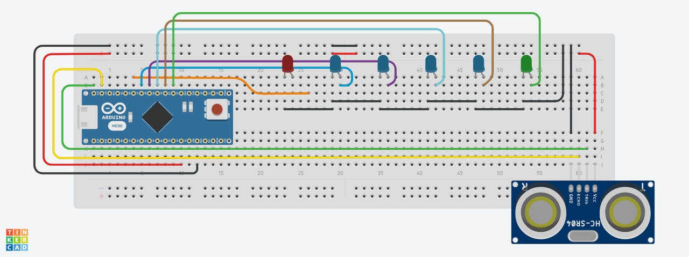

# POCWashLight
Proof Of Concept WashLight

## Getting Started
Download Arduino IDE, WashLightV2.ino en open deze met de Arduino IDE. 
Sluit Arduino setup aan, selecteer de juiste poort en run WashLightV2.ino

## Prerequisites
De juiste Arduino Setup is hiervoor nodig.

De juiste omgeving is een wasbak met kraan.

## Built With
* Arduino IDE - Code editor for Arduino

## Authors
Maik Henckens - Initial work - Maik Henckens

## Acknowledgments
YouTube tutorials
Online articles

